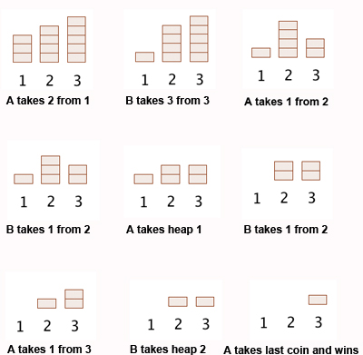

# Nim Game with AI

## Overview

This project implements the classic game of **Nim**, where players take turns removing objects from piles. The goal is to be the player who removes the last object. The project includes an AI that utilizes **Q-learning**, a reinforcement learning algorithm, to learn and improve its gameplay through self-play.

## Table of Contents

1. [Game Description](#game-description)
2. [Installation](#installation)
3. [How to Play](#how-to-play)
4. [AI Training](#ai-training)
5. [Understanding the Code](#understanding-the-code)
6. [License](#license)

## Game Description

### What is Nim?

Nim is a strategic two-player game played with several piles of objects. The rules are simple:



- **Setup**: The game starts with a number of piles containing a varying number of objects. For example, a starting configuration could be `[1, 3, 5, 7]`, which means there are four piles containing 1, 3, 5, and 7 objects, respectively.
  
- **Gameplay**:
  - Players take turns choosing one pile and removing one or more objects from it. 
  - A player can only remove objects from a single pile during their turn.
  - The player must remove at least one object but cannot remove more than what is currently in the selected pile.
  
- **Winning Condition**: The player who removes the last object from the last pile wins the game.

### Example Game Flow

1. Starting Piles: `[1, 3, 5, 7]`
2. Player 1 chooses pile 2 and removes 3 objects: `[1, 0, 5, 7]`
3. Player 2 chooses pile 3 and removes 2 objects: `[1, 0, 3, 7]`
4. Continue until one player removes the last object.

## Installation

To run the Nim game and the AI, ensure you have Python installed on your machine. You can download Python from [python.org](https://www.python.org/).

Clone this repository and navigate into the directory:

```bash
git clone https://github.com/yourusername/nim-game.git
cd nim-game
```

## How to Play

To play the game against the AI, you need to use the `play.py` file. It will handle the training and gameplay as follows:

1. Run the following command to train the AI and play a game:

```bash
python play.py
```

2. The AI will be trained for 30,000 games against itself before the gameplay starts. 
3. The current state of the piles will be displayed.
4. If it is your turn, you will be prompted to select a pile and the number of objects to remove.
5. Input your choices in the terminal.
6. The AI will then take its turn automatically.
7. The game continues until there is a winner, and the result will be displayed.

## AI Training

The AI is trained within the `play.py` file before the game begins. The training process involves the AI playing against itself, allowing it to learn optimal strategies through reinforcement learning. You can modify the training games by changing the number of games in the `train` function call in `play.py`.

## Understanding the Code

### Main Components

1. **Nim Class**: Handles the game state, including piles of objects, current player, and methods to make moves and check for a winner.

2. **NimAI Class**: Implements the Q-learning algorithm for the AI player, storing Q-values for state-action pairs and updating them based on game outcomes.

3. **Training and Play Functions**: These functions manage the gameplay loop, allowing for interaction between human players and the AI, as well as training the AI through self-play.

### Code Structure

- **nim.py**: Contains the main game logic and AI implementation.
- **play.py**: The entry point of the program that trains the AI and starts a game.
- **train(n)**: Function to train the AI by playing `n` games against itself (called in `play.py`).
- **play(ai)**: Function to facilitate a game between a human player and the AI (called in `play.py`).
